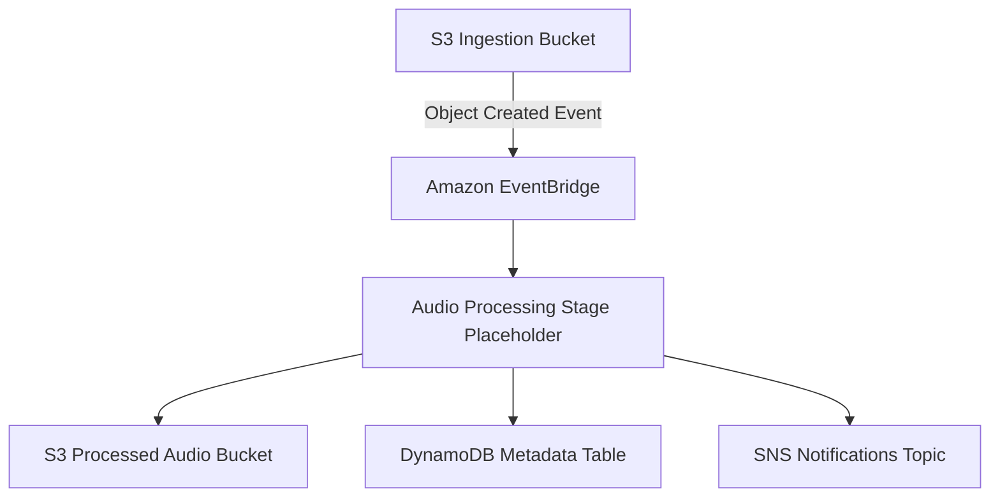

# Architecture

This repository will define an event-driven sleep audio pipeline on AWS using the Java CDK. Sleep audio source files land in an ingestion S3 bucket, which emits object-created events to Amazon EventBridge. EventBridge routes those events to downstream processing components that validate metadata, normalize and enrich the audio payload, and coordinate storage of derivative outputs. Processed audio artifacts are written back to S3, processing state and catalog metadata are recorded in DynamoDB, and important pipeline outcomes such as failures or publish-ready notifications are fanned out through SNS for operators and downstream consumers. The design is intentionally decomposed into event-driven stages so each step can be implemented and tested independently under strict TDD as the system evolves issue by issue.

