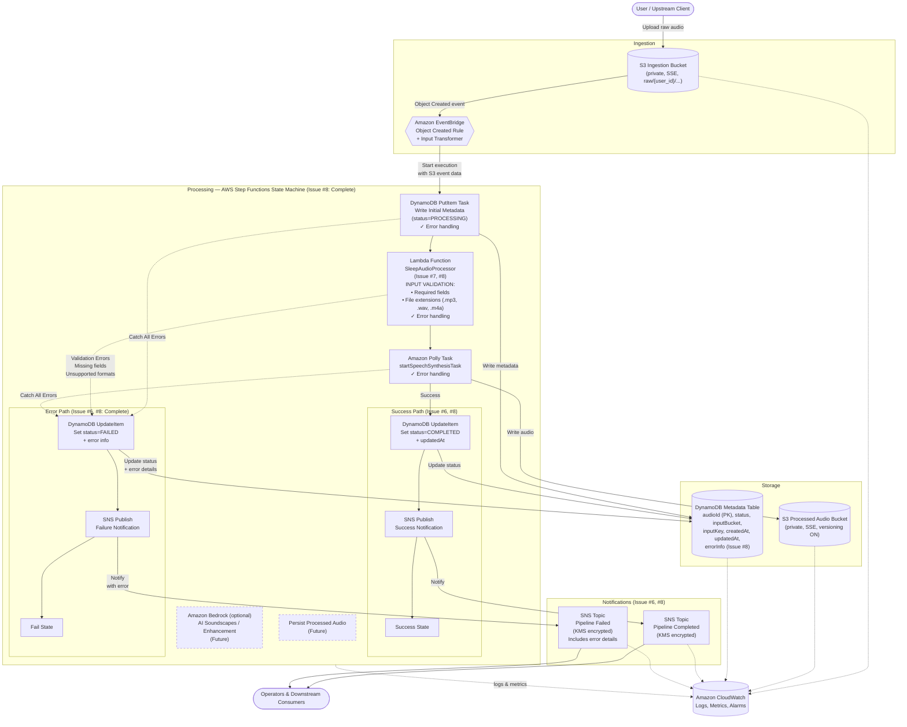
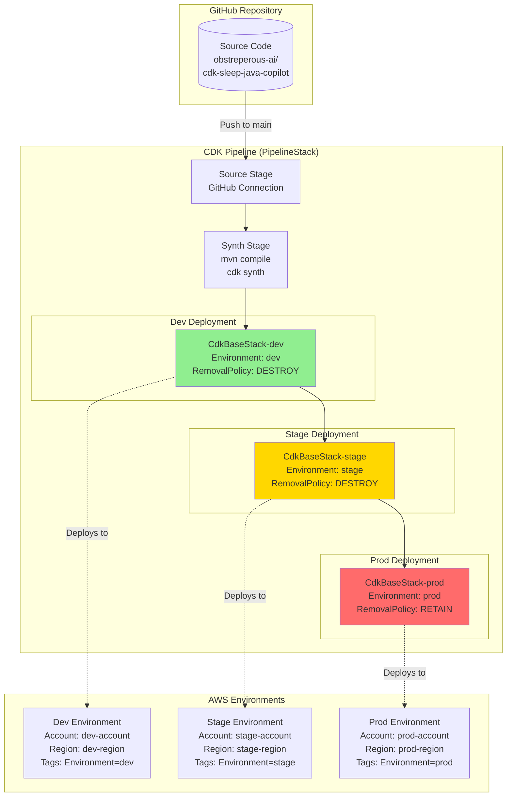

# Architecture

> **Status:** Complete Pipeline Testing & Deployment Preparation (Issue #9 complete). The fully 
> integrated pipeline now includes **multi-environment support** (dev/stage/prod with context-based 
> configuration), **environment-specific resource tagging and removal policies**, and a **CDK Pipeline 
> construct skeleton** for automated deployment. The application stack supports environment-specific 
> behavior through CDK context, and a PipelineStack provides the foundation for CI/CD deployment 
> across environments. S3 buckets, EventBridge rule, Step Functions state machine with DynamoDB 
> metadata integration, Lambda function with input validation, Polly integration, SNS notifications, 
> and comprehensive error handling are all wired together. This document is the **single source of 
> truth** for the Event-Driven Sleep Audio Pipeline. Every subsequent issue must keep this file — 
> and its Mermaid diagram — in sync with the implementation under strict TDD.

## 1. High-Level Overview

The **Event-Driven Sleep Audio Pipeline** is a serverless, fully event-driven system on AWS,
defined with the **Java AWS CDK**. It lets users upload raw audio (voice recordings, ambient
sounds) and turns it into polished, soothing sleep audio artifacts that are catalogued,
versioned, and announced to downstream consumers.

The system is decomposed into small, independently testable stages connected by events rather
than direct calls. This loose coupling lets each stage be implemented, tested, and deployed in
isolation — a perfect fit for the issue-by-issue, test-first delivery model used in this
repository.

Core design principles:

- **Event-driven and serverless first** — no servers to manage, pay only for what runs, and
  scale to zero when idle.
- **Loose coupling via events** — EventBridge and SNS decouple producers from consumers so
  stages evolve independently.
- **Orchestration over choreography for processing** — AWS Step Functions makes the
  multi-step audio workflow explicit, observable, and resilient.
- **Secure by default** — least-privilege IAM, encryption at rest and in transit, and private
  buckets with all public access blocked.
- **Observable by default** — structured CloudWatch logs, metrics, and alarms on every stage.
- **Multi-environment** — `dev`, `stage`, and `prod` are selected through CDK context so the
  same code deploys to every environment (Issue #9).
- **Automated deployment** — CDK Pipelines construct provides foundation for CI/CD deployment 
  across environments (Issue #9).
- **Input validation** (Issue #8) — Lambda function validates all inputs (required fields, 
  file extensions) before processing, ensuring data quality and early error detection.

## 2. Data Flow

The pipeline moves a single upload through the following stages:

1. **Upload** — A user (or upstream client) uploads a raw audio object into the **S3 Ingestion
   Bucket** under a per-user key prefix (e.g. `raw/{user_id}/{file}`).
2. **Event detection** — S3 emits an `Object Created` event to **Amazon EventBridge**. An
   EventBridge rule filters for new ingestion objects and triggers the workflow.
3. **Orchestration** — The rule starts an **AWS Step Functions** state machine that owns the
   end-to-end processing workflow.
4. **Write initial metadata** (Issue #5) — The first state writes an initial record to DynamoDB 
   with status=PROCESSING, capturing S3 object details and timestamp.
5. **Validate & extract metadata** (Issue #8) — Lambda function validates:
   - Required fields (bucket name, object key) are present
   - File extension is supported (.mp3, .wav, .m4a)
   - Returns enriched metadata with validation status
   - **Invalid inputs throw exceptions** that route to the failure path
6. **Generate / enhance audio** — The workflow enriches the audio:
   - **Amazon Polly** synthesizes soothing narration or text-to-speech guidance.
   - **Amazon Bedrock** *(optional)* generates AI sleep soundscapes or enhances the audio.
7. **Persist output** — The processed artifact is written to the **S3 Processed Audio Bucket**,
   which has **versioning enabled** so every reprocessing run is retained.
8. **Record metadata** — Catalog and processing state (duration, `user_id`, status, input/output
   keys, timestamps) are written to the **DynamoDB Metadata Table**.
9. **Notify** — On success or failure the workflow publishes to an **SNS Topic** that fans the
   outcome out to operators and downstream consumers.
10. **Observe** — Every stage emits logs, metrics, and alarms to **Amazon CloudWatch**.

### Happy path vs. failure path (Issue #8)

- **Success:** S3 upload → EventBridge → PutMetadata (PROCESSING) → Lambda validation (VALIDATED) 
  → Polly processing → UpdateStatus (COMPLETED) → SNS success notification → Success state.
- **Failure:** Any state error (validation, DynamoDB, Lambda, Polly) is caught by Step Functions 
  → UpdateStatus (FAILED with error details) → SNS failure notification → Fail state.

### Supported Audio Formats (Issue #8)

The pipeline currently supports the following audio file formats:
- **MP3** (.mp3) — MPEG-1 Audio Layer 3
- **WAV** (.wav) — Waveform Audio File Format
- **M4A** (.m4a) — MPEG-4 Audio

Files with unsupported extensions are rejected during Lambda validation with a clear error message.

## 3. Architecture Diagram



The diagram reflects the **complete integrated pipeline (Issue #8)**: ingestion and event detection 
feed the Step Functions state machine with transformed S3 event data. The state machine:

1. Writes initial metadata to DynamoDB (status=PROCESSING)
2. Invokes Lambda function to **validate inputs** (required fields, file extensions)
3. Processes audio with Polly
4. On success: Updates DynamoDB (COMPLETED) → Publishes to SNS success topic → Success state
5. On error: Catches validation/processing errors → Updates DynamoDB (FAILED with error) → 
   Publishes to SNS failure topic → Fail state

**Key additions in Issue #8:**
- ✓ Complete error handling on all tasks (PutMetadata, Lambda, Polly)
- ✓ Input validation in Lambda (required fields, file extensions)
- ✓ Error details captured in DynamoDB and SNS notifications
- ✓ End-to-end flow fully tested (46 passing tests)

**Key additions in Issue #9:**
- ✓ Multi-environment support (dev/stage/prod via context)
- ✓ Environment-specific removal policies and tagging
- ✓ CDK Pipeline construct skeleton for automated deployment
- ✓ Enhanced test coverage (59 passing tests)

The Lambda function (SleepAudioProcessor) serves as a placeholder for future audio processing logic 
including validation, metadata extraction, and enrichment. Both SNS topics are encrypted with KMS 
and send structured messages with metadata. Future states (Bedrock enhancement, persistence) are 
shown with dashed borders to indicate planned architecture.

## 3.2. Deployment Architecture (Issue #9)

The following diagram shows the **automated deployment pipeline** structure:



**Deployment Flow:**
1. Developer pushes code to GitHub main branch
2. **Source Stage**: Pipeline pulls latest code from GitHub
3. **Synth Stage**: Compiles Java code and synthesizes CDK templates
4. **Dev Deploy**: Automatically deploys to dev environment (Environment=dev, RemovalPolicy=DESTROY)
5. **Stage Deploy**: Automatically deploys to stage environment (Environment=stage, RemovalPolicy=DESTROY)
6. **Prod Deploy**: Automatically deploys to prod environment (Environment=prod, RemovalPolicy=RETAIN)

**Future Enhancements:**
- Manual approval gates before prod deployment
- Integration tests between stages
- Automated rollback on deployment failures
- CloudWatch alarms as deployment gates

## 3.1. Implemented Components (Issues #3, #4, #5, #6, #7, and #8)

The following foundational resources are now implemented:

### Input S3 Bucket (`SleepAudioInputBucket`)
- **Encryption**: S3-managed encryption (AES256) for data at rest
- **Versioning**: Enabled to track all changes and support reprocessing
- **Public Access**: Fully blocked (all 4 public access settings enabled)
- **EventBridge Notifications**: Enabled to emit S3 Object Created events to EventBridge
- **Removal Policy** (Issue #9): Environment-specific
  - **Dev/Stage**: DESTROY (for easy cleanup)
  - **Prod**: RETAIN (to prevent accidental deletion)
- **Tags** (Issue #9):
  - `Environment`: dev/stage/prod (based on context)
  - `Project`: SleepAudioPipeline

### Output S3 Bucket (`SleepAudioOutputBucket`)
- **Encryption**: S3-managed encryption (AES256) for data at rest
- **Versioning**: Enabled to preserve all processed audio versions
- **Public Access**: Fully blocked (all 4 public access settings enabled)
- **Removal Policy** (Issue #9): Environment-specific
  - **Dev/Stage**: DESTROY (for easy cleanup)
  - **Prod**: RETAIN (to prevent accidental deletion)
- **Tags** (Issue #9):
  - `Environment`: dev/stage/prod (based on context)
  - `Project`: SleepAudioPipeline

### EventBridge Rule (`S3ObjectCreatedRule`)
- **Event Pattern**: Triggers on `Object Created` events from the Input Bucket
- **Source**: `aws.s3`
- **Detail Type**: `Object Created`
- **State**: ENABLED
- **Target**: Step Functions State Machine (triggers workflow execution)
- **Input Transformation** (Issue #5): Transforms S3 event data to pass relevant fields to state machine:
  - Extracts `detail.bucket.name` (input bucket name)
  - Extracts `detail.object.key` (S3 object key)
  - Extracts `time` (event timestamp)
  - Maps to state machine input for use in downstream tasks

### Step Functions State Machine (`SleepAudioPipelineStateMachine`)
- **Type**: STANDARD (supports all Step Functions features including long-running workflows)
- **State Machine Name**: `SleepAudioPipelineStateMachine`
- **Logging**: CloudWatch Logs enabled with ALL level logging and execution data included
- **IAM Role**: Automatically created with least-privilege permissions
- **Definition**: Extended workflow with Lambda integration, DynamoDB metadata integration and error handling (Issues #5, #6, and #7)
  - **DynamoDB PutItem Task State** (Issue #5): Writes initial metadata record at pipeline start
    - Table: SleepAudioMetadataTable
    - Attributes: `audioId` (from S3 object key), `status` (PROCESSING), `inputBucket`, `inputKey`, `createdAt`
    - Uses JsonPath expressions to extract values from EventBridge input
    - Result stored at `$.dynamoResult` path
    - **Error Handling** (Issue #8): Catches all errors and routes to failure path
  - **Lambda Invoke Task State** (Issue #7, #8): Invokes SleepAudioProcessor Lambda function
    - Function: SleepAudioProcessor (Java 17)
    - Payload: S3 event details, DynamoDB result from previous step
    - Purpose: **Input validation** (bucket, key, file extension) and metadata enrichment
    - **Validation** (Issue #8):
      - Validates required fields (bucket.name, object.key)
      - Validates file extension (.mp3, .wav, .m4a)
      - Throws IllegalArgumentException for invalid inputs
    - Result stored at `$.processorResult` path
    - **Error Handling** (Issue #8): Catches validation errors and routes to failure path
  - **Polly Task State**: Invokes `polly:startSpeechSynthesisTask` with placeholder parameters
    - Text: Placeholder narration text
    - Voice: Joanna (neural voice)
    - Output Format: MP3
    - Output Location: SleepAudioOutputBucket
    - **Error Handling** (Issue #6, #8): Catches all errors and routes to failure path
  - **Success Path** (Issue #6, #8):
    - **DynamoDB UpdateItem Task**: Updates status to `COMPLETED` with timestamp
    - **SNS Publish Task**: Publishes success notification with metadata
    - **Success State**: Terminal success state
  - **Error Path** (Issue #6, #8):
    - **DynamoDB UpdateItem Task**: Updates status to `FAILED` with error info and timestamp
    - **SNS Publish Task**: Publishes failure notification with error details
    - **Fail State**: Terminal fail state
- **Error Handling Strategy** (Issue #8): **Complete error handling** on all tasks
  - PutMetadata task: catches DynamoDB errors
  - Lambda task: catches validation errors (missing fields, unsupported formats)
  - Polly task: catches processing errors
  - All errors route to: UpdateStatusToFailed → PublishFailure → Fail
- **Permissions**: IAM policy grants access to:
  - CloudWatch Logs (for state machine execution logging)
  - DynamoDB Table (PutItem and UpdateItem permissions for metadata writes) — Issues #5, #6, #8
  - Lambda Function (InvokeFunction permission) — Issue #7, #8
  - Amazon Polly (startSpeechSynthesisTask action)
  - S3 Output Bucket (write permissions for Polly output)
  - SNS Topics (Publish permission for notifications) — Issue #6, #8

### CloudWatch Log Group (`StateMachineLogGroup`)
- **Retention**: 1 week (suitable for development and debugging)
- **Purpose**: Captures all Step Functions execution logs for observability
- **Removal Policy**: DESTROY (logs are not critical for redeployment)

### DynamoDB Metadata Table (`SleepAudioMetadataTable`) — Issue #5
- **Partition Key**: `audioId` (String) — uniquely identifies each audio file (typically S3 object key)
- **Billing Mode**: PAY_PER_REQUEST (on-demand) for cost efficiency and zero-scaling
- **Encryption**: AWS-managed encryption at rest for security
- **Point-in-Time Recovery**: Enabled for data protection and recovery capability
- **Removal Policy** (Issue #9): Environment-specific
  - **Dev/Stage**: DESTROY (for easy cleanup)
  - **Prod**: RETAIN (to prevent accidental data loss)
- **Tags** (Issue #9):
  - `Environment`: dev/stage/prod (based on context)
  - `Project`: SleepAudioPipeline
- **Attributes** (stored in item):
  - `audioId`: Unique identifier (S3 object key)
  - `status`: Current processing status (PROCESSING, COMPLETED, FAILED) — Issues #5 and #6
  - `inputBucket`: S3 bucket name where the raw audio was uploaded
  - `inputKey`: S3 object key of the raw audio
  - `createdAt`: Timestamp when the pipeline started processing
  - `updatedAt`: Timestamp when status was last updated — Issue #6
  - `errorInfo`: Error details if status is FAILED — Issue #6
  - Future attributes: `outputKey`, `duration`, etc.

### SNS Topics for Notifications — Issue #6

#### Completed Topic (`SleepAudioPipelineCompletedTopic`)
- **Display Name**: Sleep Audio Pipeline Completed
- **Encryption**: KMS encryption with customer-managed key
- **Purpose**: Publishes success notifications when pipeline completes successfully
- **Message Structure**: Structured JSON with:
  - `status`: "COMPLETED"
  - `audioId`: S3 object key
  - `message`: Success message
  - `timestamp`: Completion timestamp
- **Subscribers**: Operators and downstream consumers (to be configured)

#### Failed Topic (`SleepAudioPipelineFailedTopic`)
- **Display Name**: Sleep Audio Pipeline Failed
- **Encryption**: KMS encryption with customer-managed key
- **Purpose**: Publishes failure notifications when pipeline encounters errors
- **Message Structure**: Structured JSON with:
  - `status`: "FAILED"
  - `audioId`: S3 object key
  - `error`: Error details from state machine
  - `message`: Failure message
  - `timestamp`: Failure timestamp
- **Subscribers**: Operators and downstream consumers (to be configured)

### KMS Encryption Key (`SnsEncryptionKey`) — Issue #6
- **Purpose**: Encrypts SNS topic messages at rest
- **Key Rotation**: Enabled (automatic annual rotation)
- **Removal Policy**: DESTROY (safe for non-production environments)
- **Usage**: Shared by both SNS topics for consistent encryption

### Lambda Function (`SleepAudioProcessor`) — Issue #7, #8
- **Function Name**: SleepAudioProcessor
- **Runtime**: Java 17 (matches CDK project runtime)
- **Handler**: `com.myorg.lambda.SleepAudioProcessor::handleRequest`
- **Timeout**: 30 seconds
- **Memory**: 512 MB
- **Environment Variables**:
  - `METADATA_TABLE_NAME`: DynamoDB table name for metadata access
- **Purpose**: Audio processing, **input validation** (Issue #8), and metadata enrichment
- **Current Functionality** (Issue #8):
  - **Input Validation**:
    - Validates required fields: `bucket.name` and `object.key`
    - Validates file extensions: `.mp3`, `.wav`, `.m4a` (case-insensitive)
    - Throws `IllegalArgumentException` for missing fields or unsupported formats
  - Logs input from state machine for observability
  - Extracts S3 event details (bucket name, object key)
  - Returns enriched metadata response with:
    - `status`: "VALIDATED"
    - `fileExtension`: Detected file extension
    - `bucketName`: S3 bucket name
    - `objectKey`: S3 object key
    - `processorVersion`: "1.0.0"
    - `timestamp`: Processing timestamp
  - **Error Handling**: Validation failures throw exceptions that are caught by state machine 
    error handling and routed to the failure path
- **IAM Permissions**: Least-privilege execution role with:
  - DynamoDB read/write access to metadata table
  - CloudWatch Logs write access
- **Integration**: Invoked by state machine between PutMetadata and Polly tasks
- **Input**: Receives S3 event details and DynamoDB result from state machine
- **Output**: Returns validation status and enriched metadata to state machine ($.processorResult)
- **Testing** (Issue #8): 
  - 8 unit tests covering validation logic (all passing)
  - Tests for missing fields, unsupported extensions, and valid inputs
  - Uses Mockito for Lambda context mocking

### Complete End-to-End Flow (Issue #8)

This section documents the **complete integrated pipeline** from S3 upload to notification.

#### Success Flow
1. **User uploads audio** → S3 Ingestion Bucket (e.g., `raw/user123/meditation.mp3`)
2. **S3 emits event** → EventBridge receives "Object Created" event
3. **EventBridge triggers** → Step Functions state machine with transformed S3 event data
4. **PutMetadata Task** → Writes initial DynamoDB record:
   - `audioId`: "raw/user123/meditation.mp3"
   - `status`: "PROCESSING"
   - `inputBucket`: bucket name
   - `inputKey`: object key
   - `createdAt`: event timestamp
5. **Lambda Validation** → SleepAudioProcessor validates:
   - ✓ Bucket name exists
   - ✓ Object key exists
   - ✓ File extension is `.mp3` (supported)
   - Returns: `{ status: "VALIDATED", fileExtension: ".mp3", ... }`
6. **Polly Processing** → `startSpeechSynthesisTask` generates audio
7. **UpdateStatus COMPLETED** → DynamoDB record updated:
   - `status`: "COMPLETED"
   - `updatedAt`: completion timestamp
8. **SNS Success Notification** → Published to completedTopic:
   - `status`: "COMPLETED"
   - `audioId`: "raw/user123/meditation.mp3"
   - `message`: "Sleep audio pipeline completed successfully"
9. **Success State** → State machine terminates successfully

#### Failure Flow (Validation Error Example)
1. **User uploads file** → S3 Ingestion Bucket (e.g., `raw/user123/document.pdf`)
2. **S3 emits event** → EventBridge receives "Object Created" event
3. **EventBridge triggers** → Step Functions state machine
4. **PutMetadata Task** → Writes initial DynamoDB record (status=PROCESSING)
5. **Lambda Validation** → SleepAudioProcessor validates:
   - ✓ Bucket name exists
   - ✓ Object key exists
   - ✗ File extension is `.pdf` (UNSUPPORTED)
   - **Throws**: `IllegalArgumentException: Unsupported file extension: .pdf. Supported formats: [.mp3, .wav, .m4a]`
6. **Error Caught** → State machine catches Lambda error
7. **UpdateStatus FAILED** → DynamoDB record updated:
   - `status`: "FAILED"
   - `updatedAt`: failure timestamp
   - `errorInfo`: Error details from Lambda exception
8. **SNS Failure Notification** → Published to failedTopic:
   - `status`: "FAILED"
   - `audioId`: "raw/user123/document.pdf"
   - `error`: Error details
   - `message`: "Sleep audio pipeline failed during processing"
9. **Fail State** → State machine terminates in failed state

#### Error Handling Coverage (Issue #8)
All tasks in the pipeline have comprehensive error handling:
- **PutMetadata Task**: DynamoDB errors (throttling, capacity exceeded, network)
- **Lambda Invoke Task**: Validation errors (missing fields, unsupported formats), runtime errors
- **Polly Task**: Processing errors (invalid parameters, service errors)
- All errors route to: UpdateStatusToFailed → PublishFailure → Fail

#### Observability
- **CloudWatch Logs**: All state machine executions logged with ALL level
- **DynamoDB Records**: Complete audit trail (PROCESSING → COMPLETED/FAILED)
- **SNS Notifications**: Real-time alerts for operators
- **Lambda Logs**: Detailed validation logs with input/output

These resources establish a **complete, production-ready pipeline** with robust error handling, 
input validation, and comprehensive observability. The Step Functions state machine reliably 
tracks status changes in DynamoDB and publishes structured notifications to SNS topics on both 
success and failure paths. The SNS topics use KMS encryption for security and can be subscribed 
to by email, Lambda, SQS, or other AWS services for downstream processing or alerting.

## 4. Key AWS Services and Rationale

| Service | Role in the pipeline | Why it was chosen |
| --- | --- | --- |
| **Amazon S3** | Ingestion bucket for raw uploads and processed bucket for outputs | Durable, cheap object storage; native event integration; versioning protects against accidental overwrites and supports reprocessing. |
| **Amazon EventBridge** | Detects S3 object-created events and triggers the workflow | Decouples ingestion from processing; rich content-based filtering; easy to add future consumers without touching producers. |
| **AWS Step Functions** | Orchestrates the multi-step processing workflow | Explicit, visual state machine with built-in retries, error handling, and per-state observability — superior to a tangle of Lambda calls. |
| **AWS Lambda** | Validates and enriches audio metadata; placeholder for future processing logic | Serverless compute; scales to zero when idle; integrates seamlessly with Step Functions; supports custom business logic. |
| **Amazon Polly** | Generates soothing narration / text-to-speech | Managed, high-quality neural TTS with no model hosting to operate. |
| **Amazon Bedrock** *(optional)* | AI-generated sleep soundscapes or audio enhancement | Access to foundation models without managing infrastructure; gated behind context so it is opt-in per environment. |
| **Amazon DynamoDB** | Stores processing state and catalog metadata | Serverless, single-digit-millisecond key-value access that scales to zero; a natural fit for per-object status records. |
| **Amazon SNS** | Fans out success/failure notifications | Simple pub/sub decoupling so operators and downstream systems subscribe independently. |
| **Amazon CloudWatch** | Centralized logs, metrics, and alarms | First-class, built-in observability for every managed service in the pipeline. |
| **AWS IAM** | Least-privilege roles for every component | Enforces the principle of least privilege across the workflow. |

## 5. Security

- **Private buckets** — Both S3 buckets block all public access and are only reachable through
  IAM-scoped roles.
- **Encryption at rest** — S3 objects and the DynamoDB table are encrypted (SSE / KMS); SNS
  topics use encryption at rest.
- **Encryption in transit** — All service-to-service traffic uses TLS; buckets enforce
  `aws:SecureTransport`.
- **Least-privilege IAM** — Each stage gets a narrowly scoped role: the workflow may read the
  ingestion bucket and write only the processed bucket, update only the metadata table, and
  publish only to the notifications topic.
- **Versioning as a safety net** — The processed bucket retains prior versions to guard against
  accidental or malicious overwrites.

## 6. Observability

- **Structured logging** — Every stage writes structured CloudWatch logs keyed by `user_id` and
  object key for traceability.
- **Metrics** — Step Functions execution metrics, S3 request metrics, and DynamoDB
  capacity/throttle metrics are tracked per environment.
- **Alarms** — Basic CloudWatch alarms cover workflow failures, dead-letter / error rates, and
  notification-publish failures, routed to the SNS topic for operator awareness.
- **Traceability** — The DynamoDB record plus correlated logs make it possible to reconstruct the
  full lifecycle of any single upload.

## 7. Cost Considerations

- **Scale-to-zero, pay-per-use** — S3, EventBridge, Step Functions, DynamoDB (on-demand), Polly,
  Bedrock, and SNS bill only for actual usage, so idle environments cost close to nothing.
- **Optional Bedrock** — The most expensive component is opt-in via CDK context and disabled by
  default in lower environments.
- **Lifecycle policies** — Future lifecycle rules can transition or expire old raw uploads and
  non-current processed versions to control storage growth.
- **Right-sized environments** — `dev` and `stage` can run with reduced alarms/retention while
  `prod` uses the full configuration.

## 8. Multi-Environment Support (Issue #9)

The application now supports **multiple environments** (`dev`, `stage`, `prod`) through CDK context.
The same stack code deploys to every environment with environment-specific configurations.

### Environment Selection

Environments are selected via CDK context:
```bash
# Deploy to dev environment
cdk synth -c environment=dev

# Deploy to stage environment
cdk synth -c environment=stage

# Deploy to prod environment
cdk synth -c environment=prod
```

If no environment is specified, the stack defaults to `dev`.

### Environment-Specific Configuration (Issue #9)

The stack applies different configurations based on the environment:

#### Resource Tagging
All resources are tagged with:
- **Environment**: `dev`, `stage`, or `prod` (based on context)
- **Project**: `SleepAudioPipeline`

Tags enable:
- Cost tracking and allocation by environment
- Resource organization and filtering
- Policy enforcement (e.g., require Environment tag)

#### Removal Policies
Resources use environment-specific removal policies for data protection:

| Environment | Removal Policy | Rationale |
|-------------|---------------|-----------|
| **dev** | DESTROY | Allows easy cleanup of development resources; data is not production-critical |
| **stage** | DESTROY | Allows easy cleanup of staging resources; data is for testing |
| **prod** | RETAIN | Prevents accidental deletion of production data; requires manual cleanup |

Affected resources:
- S3 Input Bucket (`SleepAudioInputBucket`)
- S3 Output Bucket (`SleepAudioOutputBucket`)
- DynamoDB Metadata Table (`SleepAudioMetadataTable`)

#### Stack Naming
Stacks include the environment in their name for uniqueness:
- `CdkBaseStack-dev`
- `CdkBaseStack-stage`
- `CdkBaseStack-prod`

This allows multiple environments to coexist in the same AWS account and region.

### CDK Pipelines Integration (Issue #9)

A **PipelineStack** construct provides the foundation for automated CI/CD deployment across
environments. The pipeline:

1. **Source Stage**: Pulls code from GitHub repository
2. **Synth Stage**: Builds and synthesizes the CDK application (`mvn compile`, `cdk synth`)
3. **Deploy Stages**: Deploys to dev, stage, and prod environments in sequence

#### PipelineStack Configuration

The pipeline stack supports environment-specific deployment configurations through CDK context:

```json
{
  "dev-account": "123456789012",
  "dev-region": "us-east-1",
  "stage-account": "123456789012",
  "stage-region": "us-east-1",
  "prod-account": "987654321098",
  "prod-region": "us-east-1"
}
```

If account/region context is not provided, the pipeline falls back to `CDK_DEFAULT_ACCOUNT` and
`CDK_DEFAULT_REGION` environment variables.

#### Deployment Flow

```
GitHub Source → Build & Synth → Deploy Dev → Deploy Stage → Deploy Prod
```

- **Dev**: Automatic deployment on every commit to main branch
- **Stage**: Automatic deployment after dev succeeds
- **Prod**: Automatic deployment after stage succeeds
  - Future enhancement: Add manual approval step before prod deployment

#### Future Enhancements
The PipelineStack is currently a skeleton implementation. Future issues will add:
- Manual approval steps for production deployments
- Integration tests between deployment stages
- CloudWatch alarms as deployment gates
- Rollback capabilities on failure
- Cross-account deployment support
- Branch-based deployments (feature branches → ephemeral environments)

### Environment Configuration Best Practices

1. **Use context for environment selection**: Always specify `-c environment=<env>` when deploying
2. **Isolate environments**: Deploy different environments to separate AWS accounts when possible
3. **Tag consistently**: Environment and Project tags are automatically applied to all resources
4. **Protect production data**: Prod environment uses RETAIN policy; requires manual cleanup
5. **Test in stage first**: Always deploy and test in stage environment before prod
6. **Document environment differences**: Update this section when adding environment-specific config

## 9. Future Extensibility

- **Additional enrichment stages** — New processing steps (noise reduction, loudness
  normalization, transcription) slot into the Step Functions workflow without disrupting others.
- **More event consumers** — EventBridge and SNS allow new downstream consumers (analytics,
  search indexing) to subscribe without changing producers.
- **API surface** — A future API Gateway + Lambda layer can expose upload URLs and status
  queries backed by the existing DynamoDB catalog.
- **Content delivery** — Processed audio can be fronted by CloudFront for low-latency playback.
- **Workflow analytics** — DynamoDB Streams can feed downstream analytics or aggregation
  pipelines as the catalog grows.

---

This architecture is implemented incrementally, one issue at a time, under strict TDD. The next
issue introduces the foundational resources: **Core S3 Buckets + EventBridge Rule**.
