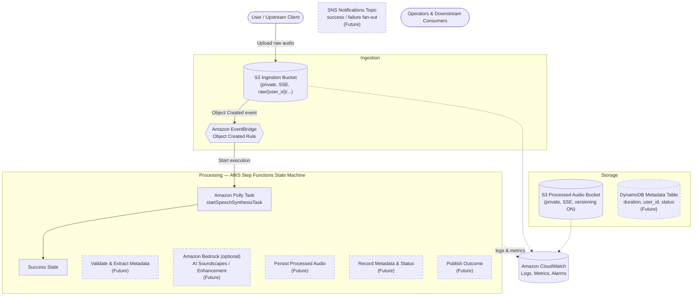

# Architecture

> **Status:** Partial Implementation (Issue #4 complete). The core S3 buckets, EventBridge
> rule, Step Functions state machine skeleton, and Polly integration are now implemented. This 
> document is the **single source of truth** for the Event-Driven Sleep Audio Pipeline. Every 
> subsequent issue must keep this file — and its Mermaid diagram — in sync with the 
> implementation under strict TDD.

## 1. High-Level Overview

The **Event-Driven Sleep Audio Pipeline** is a serverless, fully event-driven system on AWS,
defined with the **Java AWS CDK**. It lets users upload raw audio (voice recordings, ambient
sounds) and turns it into polished, soothing sleep audio artifacts that are catalogued,
versioned, and announced to downstream consumers.

The system is decomposed into small, independently testable stages connected by events rather
than direct calls. This loose coupling lets each stage be implemented, tested, and deployed in
isolation — a perfect fit for the issue-by-issue, test-first delivery model used in this
repository.

Core design principles:

- **Event-driven and serverless first** — no servers to manage, pay only for what runs, and
  scale to zero when idle.
- **Loose coupling via events** — EventBridge and SNS decouple producers from consumers so
  stages evolve independently.
- **Orchestration over choreography for processing** — AWS Step Functions makes the
  multi-step audio workflow explicit, observable, and resilient.
- **Secure by default** — least-privilege IAM, encryption at rest and in transit, and private
  buckets with all public access blocked.
- **Observable by default** — structured CloudWatch logs, metrics, and alarms on every stage.
- **Multi-environment** — `dev`, `stage`, and `prod` are selected through CDK context so the
  same code deploys to every environment.

## 2. Data Flow

The pipeline moves a single upload through the following stages:

1. **Upload** — A user (or upstream client) uploads a raw audio object into the **S3 Ingestion
   Bucket** under a per-user key prefix (e.g. `raw/{user_id}/{file}`).
2. **Event detection** — S3 emits an `Object Created` event to **Amazon EventBridge**. An
   EventBridge rule filters for new ingestion objects and triggers the workflow.
3. **Orchestration** — The rule starts an **AWS Step Functions** state machine that owns the
   end-to-end processing workflow.
4. **Validate & extract metadata** — The first state validates the object (size, format,
   ownership prefix) and extracts technical metadata (duration, format, sample rate). Invalid
   inputs short-circuit to the failure path.
5. **Generate / enhance audio** — The workflow enriches the audio:
   - **Amazon Polly** synthesizes soothing narration or text-to-speech guidance.
   - **Amazon Bedrock** *(optional)* generates AI sleep soundscapes or enhances the audio.
6. **Persist output** — The processed artifact is written to the **S3 Processed Audio Bucket**,
   which has **versioning enabled** so every reprocessing run is retained.
7. **Record metadata** — Catalog and processing state (duration, `user_id`, status, input/output
   keys, timestamps) are written to the **DynamoDB Metadata Table**.
8. **Notify** — On success or failure the workflow publishes to an **SNS Topic** that fans the
   outcome out to operators and downstream consumers.
9. **Observe** — Every stage emits logs, metrics, and alarms to **Amazon CloudWatch**.

### Happy path vs. failure path

- **Success:** validate → enhance → write output (versioned) → record `COMPLETED` in DynamoDB →
  publish success to SNS.
- **Failure:** any state error is caught by Step Functions → record `FAILED` (with reason) in
  DynamoDB → publish failure to SNS for operator follow-up.

## 3. Architecture Diagram

The diagram reflects the current implementation (Issue #4): ingestion and event detection feed 
the Step Functions state machine, which currently contains a minimal Polly task followed by a 
success state. Future states (validation, Bedrock enhancement, persistence, cataloguing, and 
notification) are shown with dashed borders to indicate the planned architecture.

## 3.1. Implemented Components (Issues #3 and #4)

The following foundational resources are now implemented:

### Input S3 Bucket (`SleepAudioInputBucket`)
- **Encryption**: S3-managed encryption (AES256) for data at rest
- **Versioning**: Enabled to track all changes and support reprocessing
- **Public Access**: Fully blocked (all 4 public access settings enabled)
- **EventBridge Notifications**: Enabled to emit S3 Object Created events to EventBridge
- **Removal Policy**: RETAIN to prevent accidental deletion

### Output S3 Bucket (`SleepAudioOutputBucket`)
- **Encryption**: S3-managed encryption (AES256) for data at rest
- **Versioning**: Enabled to preserve all processed audio versions
- **Public Access**: Fully blocked (all 4 public access settings enabled)
- **Removal Policy**: RETAIN to prevent accidental deletion

### EventBridge Rule (`S3ObjectCreatedRule`)
- **Event Pattern**: Triggers on `Object Created` events from the Input Bucket
- **Source**: `aws.s3`
- **Detail Type**: `Object Created`
- **State**: ENABLED
- **Target**: Step Functions State Machine (triggers workflow execution)

### Step Functions State Machine (`SleepAudioPipelineStateMachine`)
- **Type**: STANDARD (supports all Step Functions features including long-running workflows)
- **State Machine Name**: `SleepAudioPipelineStateMachine`
- **Logging**: CloudWatch Logs enabled with ALL level logging and execution data included
- **IAM Role**: Automatically created with least-privilege permissions
- **Definition**: Minimal skeleton with Polly integration
  - **Polly Task State**: Invokes `polly:startSpeechSynthesisTask` with placeholder parameters
    - Text: Placeholder narration text
    - Voice: Joanna (neural voice)
    - Output Format: MP3
    - Output Location: SleepAudioOutputBucket
  - **Success State**: Terminal success state
- **Permissions**: IAM policy grants access to:
  - CloudWatch Logs (for state machine execution logging)
  - Amazon Polly (startSpeechSynthesisTask action)
  - S3 Output Bucket (write permissions for Polly output)

### CloudWatch Log Group (`StateMachineLogGroup`)
- **Retention**: 1 week (suitable for development and debugging)
- **Purpose**: Captures all Step Functions execution logs for observability
- **Removal Policy**: DESTROY (logs are not critical for redeployment)

These resources establish the complete event-driven orchestration foundation for the pipeline. The
Step Functions state machine provides a skeleton workflow that can be extended with additional
processing states in future issues. The Polly integration demonstrates the pattern for adding
AWS service integrations using the `CallAwsService` construct.

## 4. Key AWS Services and Rationale

| Service | Role in the pipeline | Why it was chosen |
| --- | --- | --- |
| **Amazon S3** | Ingestion bucket for raw uploads and processed bucket for outputs | Durable, cheap object storage; native event integration; versioning protects against accidental overwrites and supports reprocessing. |
| **Amazon EventBridge** | Detects S3 object-created events and triggers the workflow | Decouples ingestion from processing; rich content-based filtering; easy to add future consumers without touching producers. |
| **AWS Step Functions** | Orchestrates the multi-step processing workflow | Explicit, visual state machine with built-in retries, error handling, and per-state observability — superior to a tangle of Lambda calls. |
| **Amazon Polly** | Generates soothing narration / text-to-speech | Managed, high-quality neural TTS with no model hosting to operate. |
| **Amazon Bedrock** *(optional)* | AI-generated sleep soundscapes or audio enhancement | Access to foundation models without managing infrastructure; gated behind context so it is opt-in per environment. |
| **Amazon DynamoDB** | Stores processing state and catalog metadata | Serverless, single-digit-millisecond key-value access that scales to zero; a natural fit for per-object status records. |
| **Amazon SNS** | Fans out success/failure notifications | Simple pub/sub decoupling so operators and downstream systems subscribe independently. |
| **Amazon CloudWatch** | Centralized logs, metrics, and alarms | First-class, built-in observability for every managed service in the pipeline. |
| **AWS IAM** | Least-privilege roles for every component | Enforces the principle of least privilege across the workflow. |

## 5. Security

- **Private buckets** — Both S3 buckets block all public access and are only reachable through
  IAM-scoped roles.
- **Encryption at rest** — S3 objects and the DynamoDB table are encrypted (SSE / KMS); SNS
  topics use encryption at rest.
- **Encryption in transit** — All service-to-service traffic uses TLS; buckets enforce
  `aws:SecureTransport`.
- **Least-privilege IAM** — Each stage gets a narrowly scoped role: the workflow may read the
  ingestion bucket and write only the processed bucket, update only the metadata table, and
  publish only to the notifications topic.
- **Versioning as a safety net** — The processed bucket retains prior versions to guard against
  accidental or malicious overwrites.

## 6. Observability

- **Structured logging** — Every stage writes structured CloudWatch logs keyed by `user_id` and
  object key for traceability.
- **Metrics** — Step Functions execution metrics, S3 request metrics, and DynamoDB
  capacity/throttle metrics are tracked per environment.
- **Alarms** — Basic CloudWatch alarms cover workflow failures, dead-letter / error rates, and
  notification-publish failures, routed to the SNS topic for operator awareness.
- **Traceability** — The DynamoDB record plus correlated logs make it possible to reconstruct the
  full lifecycle of any single upload.

## 7. Cost Considerations

- **Scale-to-zero, pay-per-use** — S3, EventBridge, Step Functions, DynamoDB (on-demand), Polly,
  Bedrock, and SNS bill only for actual usage, so idle environments cost close to nothing.
- **Optional Bedrock** — The most expensive component is opt-in via CDK context and disabled by
  default in lower environments.
- **Lifecycle policies** — Future lifecycle rules can transition or expire old raw uploads and
  non-current processed versions to control storage growth.
- **Right-sized environments** — `dev` and `stage` can run with reduced alarms/retention while
  `prod` uses the full configuration.

## 8. Multi-Environment Support

Environments (`dev`, `stage`, `prod`) are selected through **CDK context** (for example
`cdk synth -c env=dev`). The same stack code deploys to every environment, with per-environment
values (resource names, alarm thresholds, retention, and whether Bedrock is enabled) resolved
from context. This keeps environments consistent while allowing safe, isolated promotion of
changes.

## 9. Future Extensibility

- **Additional enrichment stages** — New processing steps (noise reduction, loudness
  normalization, transcription) slot into the Step Functions workflow without disrupting others.
- **More event consumers** — EventBridge and SNS allow new downstream consumers (analytics,
  search indexing) to subscribe without changing producers.
- **API surface** — A future API Gateway + Lambda layer can expose upload URLs and status
  queries backed by the existing DynamoDB catalog.
- **Content delivery** — Processed audio can be fronted by CloudFront for low-latency playback.
- **Workflow analytics** — DynamoDB Streams can feed downstream analytics or aggregation
  pipelines as the catalog grows.

---

This architecture is implemented incrementally, one issue at a time, under strict TDD. The next
issue introduces the foundational resources: **Core S3 Buckets + EventBridge Rule**.
